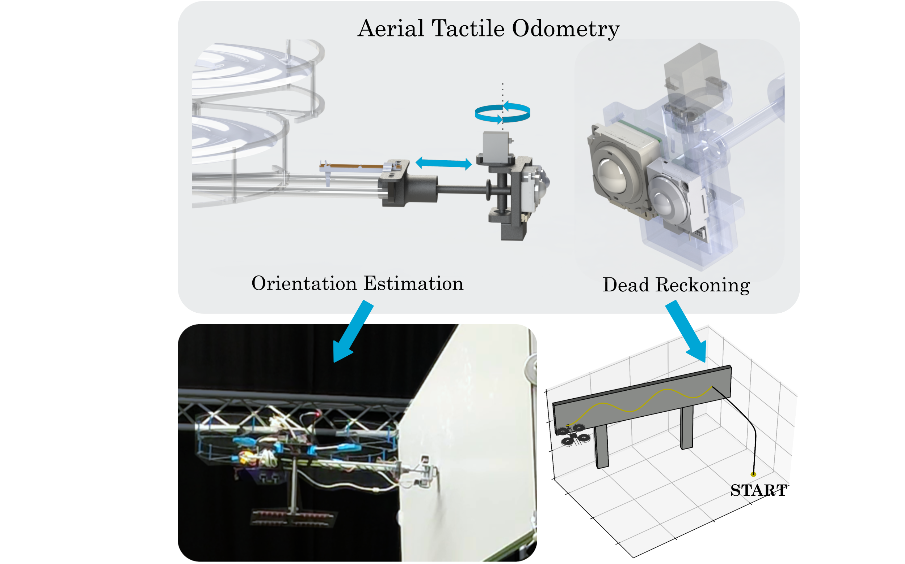
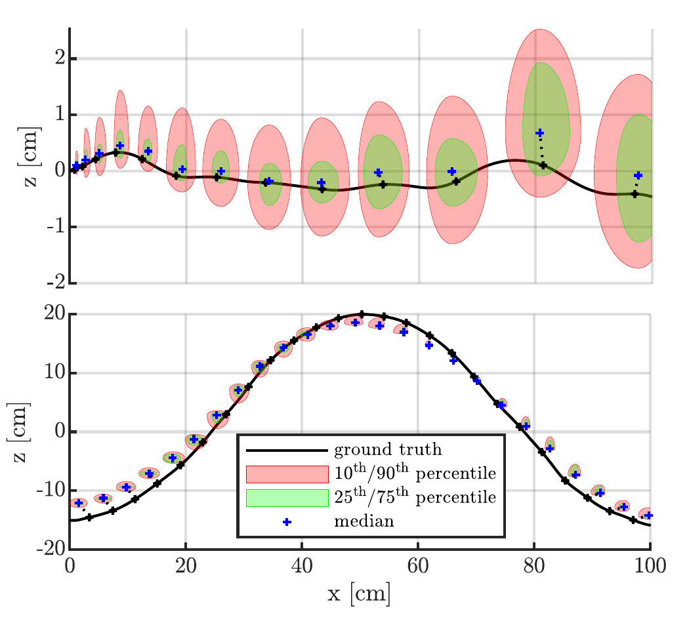
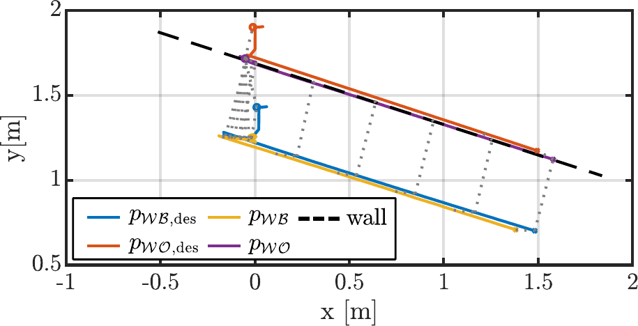

# The Tactile Odometry Drone

The Tactile Odometry Drone is a project, in which we estimate aerial robots' odometry using information from physical contact.
This repository agglomerates all information related to the tactile drone project.

# How To Cite This

To Be Determined

# Explainer Video 

  

# Background

Aerial robots are well-established technologies in environments characterized by reliable GNSS signals and favorable conditions for visual navigation. However, their robustness is significantly challenged whenever ambient lighting is insufficient, for example, in underground, dark, or foggy environments. There, conventional navigation methods solely based on computer vision are very limited. 

This work proposes the completely novel approach to _Aerial Tactile Odometry_ for pose estimation of aerial robots exploiting contact to precisely determine the system's pose. By employing a compliant end-effector design with onboard tactile information by means of a trackball, we infer the complete UAV's pose with respect to the environment, and the distance traveled during contact. 

Through a large set of experiments, the proposed method shows centimeter accuracy for various environment orientations and different trajectories followed. Akin to conventional dead-reckoning odometry methods in wheeled robotics, this method provides a valuable additional source of pose estimation, increasing the robustness of aerial robots -- especially aerial manipulators -- in the real world. 

    

# Results

In a total of 32 flight experiments, covering various relative environment orientations and trajectory profiles, the proposed methodology showcases centimeter accuracy with a relative error below 5% of the travelled distance, on average. The system is capable of following unknown flat surfaces allowing suitable contact for the position estimation in 90% of the tracked distance. 

The proposed approach is particularly suited to aerial interaction tasks where contact is desired, as such contact-based odometry provides feedback directly in the task space, enabling more precise EE control.

    
    

# Repository Structure

This repository contains all the sub-repositories that are needed to reproduce the experiments. 
All recorded data is hosted off-site at this [link](https://datashare.tu-dresden.de/index.php/s/x2TiF2Qf2MHZ5tc).
The rest of this repository is structured as follows:
- ``offboard``
    
    This folder contains all the software that is intended to be run off-board.
    This is mainly visualization modules of the system (rviz and plotting scripts) but also contains the Optitrack to ROS2 interface.

- ``onboard``

    This folder contains all the software that is intended to be run onboard on the companion computer on the drone. 
    This includes the ``micro-ros-agent`` that interfaces with PX4 running on the Pixhawk but also the drivers for the encoders, the trackball interface, as well as waypoint planner.

- ``tactile-odom-teensy``

    This repository contains all the software for the embedded controller that connects to to the encoders.

- ``tactile-odom-design``

    This repository contains all the mechanical design files.

